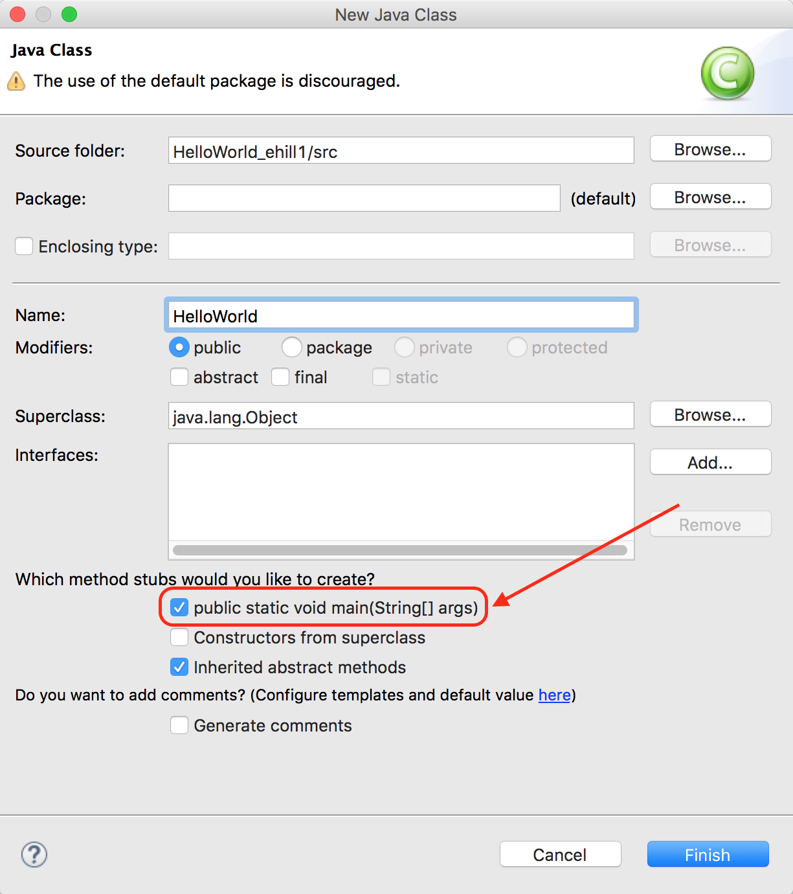

# PHW1: Hello World

Now you will create your first itty bitty Java program from scratch!



## Instructions

1. Open Eclipse and go to `File > New > Java Project`
2. Name this project `HelloWorld_uLogin` and hit `Finish`
3. Right-click on the `HelloWorld_uLogin` project folder and go to `New > Class`
4. Name the class `HelloWorld` and make sure to select the checkbox next to `public static void main(String[] args)`: 
  
*(Don't worry, we'll learn what all those words mean later!)* 
Keep in mind that you *should **not*** use your `uLogin` in class names, method names, or any other names besides your project or zip file names.
1. Double-click the project folder, the src folder, and then the default package. You should now see a class file, `HelloWorld.java`.
2. In the `main` method, type the Java code necessary to print "Hello, World!": `System.out.println("Hello, World!");`
1. To run the program:
    -  Click on the green play button at the top of the screen **OR**
    - Right-click name.java class and select “Run As > Java Application”
2. Run the program to verify your changes.

## Demonstration

Once you've finished doing the HW a single time, watch me do it:



