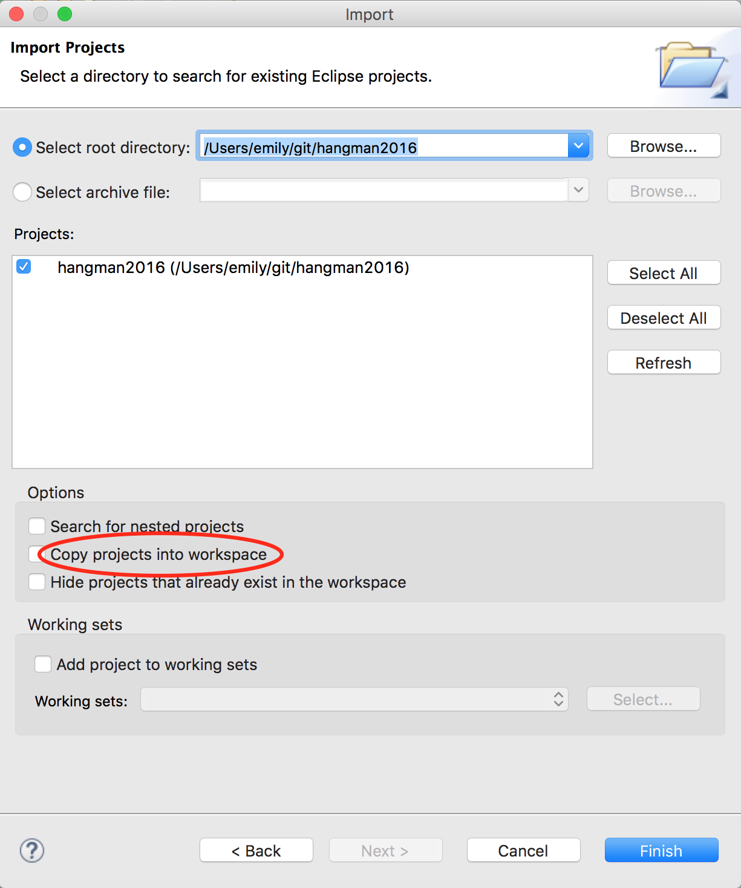
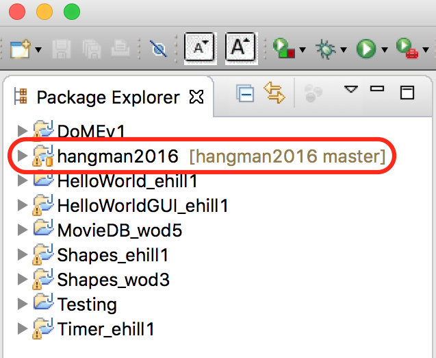

# Project: Hangman Game

[Link to our project on github](https://github.com/emhill/hangman2016)

Please see the following ppt slides and documents for additional details.

* Overview slides: [Project.pptx](project1/Project.pptx)
* [Person](project1/A-Person.docx)
* [AlphabetPanel](project1/B-AlphabetPanel.docx)
* [GuessPhrasePanel & RandomString](project1/C-GuessPhrasePanel.docx)
* [Hangman Game](project1/D-HangmanGame.docx)
* Text: [class](project1/Text.java) [Javadoc](project1/Text.html)

In this project you may work with a partner; make sure both students are clearly labelled in the comments at the top of the file you work on.

If you get stuck, please e-mail me an archive file of your project and a description of:

  1. What you expect to happen
  1. What is actually happening
  
# Deliverables
  * **Part I**: interface (just the method headers) due T 6/14 to github
  * **Part II**: implementation due R 6/16 for in-class project demo

# Getting started

In this project, we will be using git as our major collaboration tool. Why are we using git? Because:

* Git is the current industry standard for collaborative and remote development
* Many employers want to see an active github account
* Your github page becomes your programmer portfolio
* If you want to build up your resume, contribute to an open source project

Git is easy to use once you get the hang of it, but the initial setup requires several steps:

1. Create a github account – e-mail it to me
2. Download & install [SourceTree](https://www.sourcetreeapp.com/). It will install git for you if you tell it to during installation.
3. Download our repo from github through SourceTree using the URL `https://github.com/emhill/hangman2016.git`
4. Import the repo into eclipse. Do **NOT** copy the project into the workspace: 
5. When imported correctly, you should see `[master]` after the project name:  

If you have trouble with any of these steps, please see me or e-mail a screenshot of the issue.

# Workflow

Once you've successfully imported the class project into eclipse from github, you should follow the steps below when making changes that everyone in the class will be able to see.

* In SourceTree, pull to get the latest version
* Make any changes in eclipse 
* Ready for everyone else to see your changes? In SourceTree: 
* Stage the files you changed
* commit (make sure to give an informative message summarizing your changes!)
* pull (if there are conflicting changes, address these in eclipse before proceeding)
* push your changes to make them available through github

